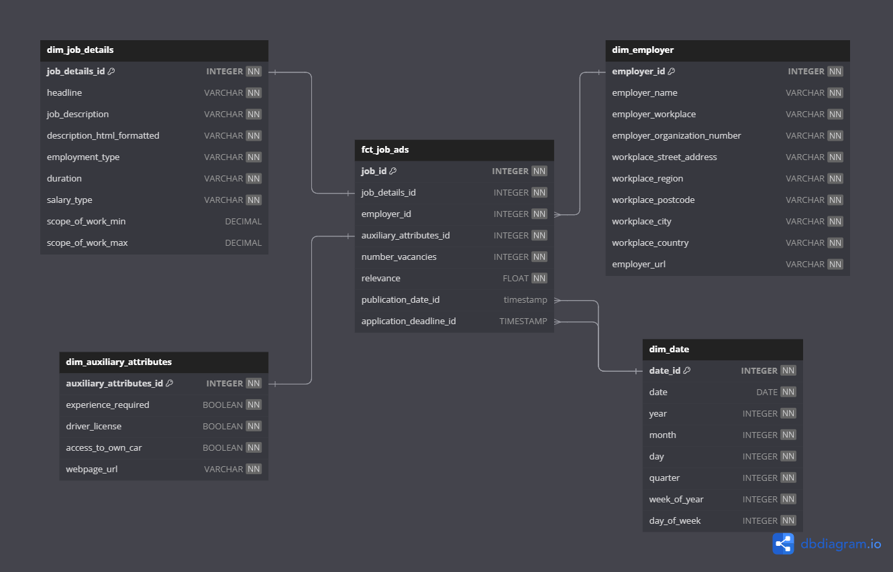

# Warehouse Lifecycle Project
### Description
This project focuses on extracting job search data via an API and loading it into Snowflake’s staging layer. The data is then transformed and moved to the warehouse and marts layers, which serve as the data source for a Streamlit dashboard. Python and DltHub are used for data extraction and loading, dbt for transformation, and Dagster for orchestrating the data pipeline. The goal is to provide a seamless flow from raw data to a structured, user-friendly dashboard interface.

### Dataflow chart


## Setup
### Snowflake setup
* Run the worksheets in folder *snowflake_worksheets* from 0 to 4
* Use [this link](https://vf10460.west-europe.azure.snowflakecomputing.com/) to connect to Snowflake and login with your information


### Python enviroment setup
* Install Python package manager UV with ```pip install uv```
* Run ```uv venv``` to create a virtual invoment
* Activate virtual enviroment through ``` source .venv/Scripts/activate ``` in windows and ``` source .venv/bin/activate ``` in mac/linux
* Install all necessary packages and dependencies for the project by running
``` uv pip install requirements.txt```

### Dlt setup
* Fill `dlt_code/.dlt/secrets.toml` with Snowflake connection credentials:
```
database = 
password = 
username = 
host = 
warehouse = 
role = 
```

### Dbt setup
* Fill `~/.dbt/profiles.yml` with Snowflake connection credentials:
```
dbt_projektledare:
  outputs:
    dev:
      account: 
      database: 
      password: 
      role: 
      schema: 
      threads: 1
      type: 
      user: 
      warehouse: 
  target: dev
```
* Run `dbt deps` to install dependencies

### Dagster setup
Fill `dagster_pipeline/dagster_pipeline/.env` with Snowflake connection credentials:
```
SNOWFLAKE_USER = 
SNOWFLAKE_PASSWORD = 
SNOWFLAKE_ACCOUNT = 
SNOWFLAKE_WAREHOUSE = 
SNOWFLAKE_DATABASE = 
SNOWFLAKE_ROLE = 
```

### Streamlit setup
Fill `streamlit_code/.env` with Snowflake connection credentials:
```
SNOWFLAKE_USER = 
SNOWFLAKE_PASSWORD = 
SNOWFLAKE_ACCOUNT = 
SNOWFLAKE_WAREHOUSE = 
SNOWFLAKE_DATABASE = 
SNOWFLAKE_SCHEMA = 
SNOWFLAKE_ROLE = 
```

## Usage
* To run dlt part alone, execute `dlt_code/dlt_projektledare.py`
* To run dbt part alone, execute "*dbt run*" `dbt_code/` folder
* To access Dagster GUI and materialize dlt and dbt assets, execute "`dagster dev`" from `dagster_pipeline/` folder
* To run the Streamlit dashboard locally, execute `streamlit_code/run_dashboard.py`. Alternatively, you can access the Streamlit dashboard on the cloud by following
[this link](https://johantokarskij-warehouse-lifecyc-streamlit-codedashboard-xa08u9.streamlit.app/)

Warehouse layer follows this ERD:
